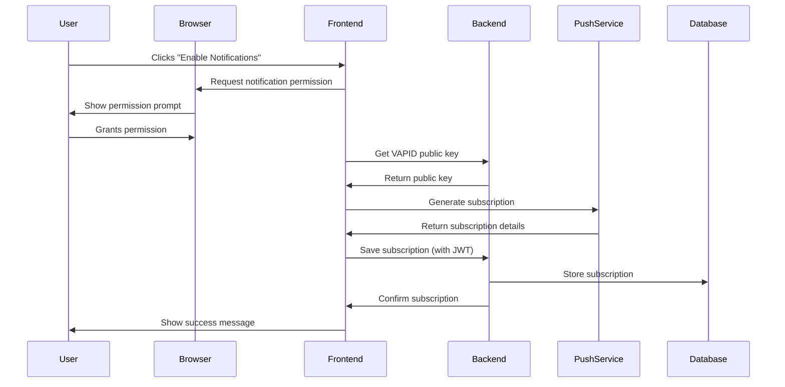
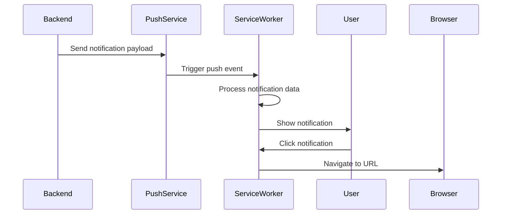

# Push Notification System Documentation

## Overview
The push notification system enables real-time communication with users even when they're not actively using the application. This system uses the Web Push Protocol and Service Workers to deliver notifications to users' devices.

## Technical Architecture

### Components
1. **Frontend Components**
   - Service Worker (`push-notification-sw.js`)
   - Push Notification Hook (`usePushNotifications.ts`)
   - Notification UI Components (`NotificationPrompt.tsx`, `NotificationTest.tsx`)

2. **Backend Components**
   - Notification Service (`notification.service.ts`)
   - Notification Controller (`notification.controller.ts`)
   - Push Subscription Storage (`push_subscriptions` table)

### Key Technologies
- **Web Push Protocol**: Standard protocol for push notifications
- **VAPID (Voluntary Application Server Identification)**: Authentication mechanism for push services
- **Service Workers**: Enable background processing and push notifications
- **PostgreSQL**: Stores subscription data
- **JWT Authentication**: Secures notification endpoints

## Workflow Diagrams

### Subscription Flow

### Notification Sending Flow

## Security Measures

### 1. VAPID Authentication
- Server identifies itself to push services using VAPID keys
- Public key shared with clients
- Private key kept secure on server
- Contact email for push service communication

### 2. API Security
- JWT authentication required for subscription endpoints
- User-specific subscription storage
- Automatic cleanup of invalid subscriptions
- Rate limiting on notification endpoints

### 3. Data Protection
- Subscriptions linked to specific users
- Encrypted payload delivery
- Secure database storage
- No sensitive data in notifications

## Database Schema

### push_subscriptions Table
\`\`\`sql
CREATE TABLE push_subscriptions (
    id UUID PRIMARY KEY DEFAULT uuid_generate_v4(),
    endpoint VARCHAR NOT NULL,
    expiration_time BIGINT NULL,
    keys JSONB NOT NULL,
    user_id UUID NOT NULL REFERENCES users(id) ON DELETE CASCADE,
    created_at TIMESTAMP DEFAULT now()
);
\`\`\`

## Implementation Details

### 1. Frontend Setup
\`\`\`typescript
// Service Worker Registration
if ('serviceWorker' in navigator && 'PushManager' in window) {
    const registration = await navigator.serviceWorker.register('/push-notification-sw.js');
    const subscription = await registration.pushManager.subscribe({
        userVisibleOnly: true,
        applicationServerKey: vapidPublicKey
    });
}
\`\`\`

### 2. Backend Configuration
\`\`\`typescript
// VAPID Setup
webPush.setVapidDetails(
    'mailto:notifications@humansoffootball.com',
    vapidPublicKey,
    vapidPrivateKey
);
\`\`\`

## Usage Examples

### 1. Sending Match Notifications
\`\`\`typescript
// Send notification to match participants
async function notifyMatchParticipants(matchId: string) {
    const players = await getMatchPlayers(matchId);
    for (const player of players) {
        await notificationService.sendNotificationToUser(player.userId, {
            title: 'Match Update',
            body: 'Your match is starting soon!',
            data: { url: `/matches/${matchId}` }
        });
    }
}
\`\`\`

### 2. Handling Notification Clicks
\`\`\`javascript
// Service Worker
self.addEventListener('notificationclick', (event) => {
    event.notification.close();
    if (event.notification.data?.url) {
        clients.openWindow(event.notification.data.url);
    }
});
\`\`\`

## Best Practices

1. **Content Guidelines**
   - Keep notifications relevant and timely
   - Include clear call-to-action
   - Respect user preferences
   - Avoid sensitive information

2. **Technical Guidelines**
   - Handle subscription expiration
   - Implement retry mechanisms
   - Monitor delivery success rates
   - Clean up invalid subscriptions

3. **Performance Considerations**
   - Batch notifications when possible
   - Implement rate limiting
   - Monitor payload size
   - Cache notification resources

## Testing

1. **Local Testing**
   - Use development environment
   - Test with multiple browsers
   - Verify offline functionality
   - Check notification interaction

2. **Production Testing**
   - Verify VAPID configuration
   - Test with real devices
   - Monitor error rates
   - Check delivery times

## Troubleshooting

### Common Issues
1. **Permission Denied**
   - Check browser settings
   - Verify domain trust
   - Review prompt timing

2. **Subscription Failures**
   - Verify VAPID keys
   - Check service worker registration
   - Confirm SSL/HTTPS setup

3. **Delivery Issues**
   - Monitor push service responses
   - Check payload format
   - Verify subscription validity

## Future Enhancements

1. **Planned Features**
   - Notification preferences
   - Custom notification sounds
   - Rich media notifications
   - Analytics integration

2. **Scalability Improvements**
   - Queue system for large broadcasts
   - Regional push services
   - Enhanced monitoring
   - Performance optimizations
